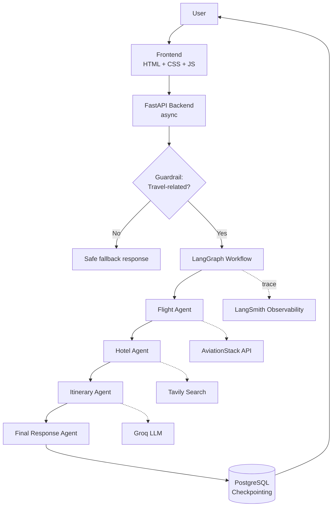
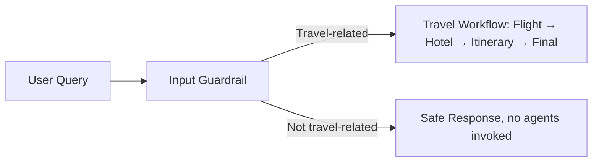

# 🌍 GoAnywhere AI

**A Multi-Agent Travel Planning System Built with LangGraph**

GoAnywhere AI is an AI-powered multi-agent system that generates complete, practical travel plans — flights, hotels, itinerary, and budget — from a single natural-language request.

🔗 **Live demo:** https://goanywhere-ai.onrender.com/
💻 **Repo:** https://github.com/Data-pageup/goanywhere-ai-langgraph

---

## Overview

Instead of one monolithic prompt, GoAnywhere AI splits travel planning across specialized agents that pass results through a shared LangGraph state:

- **Flight Agent** — retrieves flight information via a flight search tool (AviationStack)
- **Hotel Agent** — searches accommodation using Tavily Search
- **Itinerary Agent** — generates a day-by-day, budget-aware plan from the flight + hotel results
- **Final Response Agent** — formats everything into a structured travel plan (trip summary, flights, hotels, itinerary, budget, recommendations)

```
START → Flight Agent → Hotel Agent → Itinerary Agent → Final Response Agent → END
```

## System Architecture



The frontend talks to an async FastAPI backend, which first runs the request through a guardrail check before it ever reaches the agents. Once cleared, LangGraph orchestrates the four agents in sequence, each writing its output to shared state. Every run is checkpointed to PostgreSQL and traced through LangSmith, and the whole thing is deployed on Render.

## Guardrails

Agent calls, tool calls, and LLM calls all cost time and money — so before any of that runs, an input guardrail checks whether the request is actually travel-related.



**Passes the guardrail:**
- "Plan a 7-day trip to Japan from Chennai."
- "Find hotels in Dubai."
- "What flights are available from Chennai to Singapore?"

**Blocked before reaching the agents:**
- "Write Python code."
- "Explain machine learning."
- "Solve this math problem."

This keeps the multi-agent workflow scoped to its domain and prevents unrelated requests from triggering unnecessary API and LLM calls. The guardrail layer is built to be extensible — output guardrails and stricter production rules are on the roadmap.

## Key Features

- 🤖 Multi-agent architecture orchestrated with **LangGraph**
- 🛡️ **Guardrails** validate that a request is travel-related before it reaches any API or LLM call
- ⚡ **FastAPI** backend, fully asynchronous — agent and tool calls don't block each other
- 💾 **PostgreSQL** (via LangGraph's `PostgresSaver`) for persistent workflow checkpointing, so state survives across sessions
- 🧵 Thread-based conversation persistence
- 📊 **LangSmith** integration for tracing agent execution, prompts, latency, and token usage
- ☁️ Deployed end-to-end on **Render** (app + database)

## Tech Stack

| Layer | Technology |
|---|---|
| Backend | Python, FastAPI |
| Orchestration | LangGraph, LangChain |
| LLM | Groq (`openai/gpt-oss-120b`) |
| Persistence | PostgreSQL, Psycopg, LangGraph PostgresSaver |
| Observability | LangSmith |
| Search / Data | Tavily Search, AviationStack |
| Frontend | HTML, CSS, JavaScript |
| Deployment | Render |

## Project Structure

```
goanywhere-ai-langgraph/
├── app.py
├── backend.py
├── requirements.txt
├── templates/
│   └── index.html
├── static/
│   ├── style.css
│   └── script.js
└── tools/
    ├── tavily_tool.py
    └── flight_tool.py
```

## Getting Started

**1. Clone and enter the project**
```bash
git clone https://github.com/Data-pageup/goanywhere-ai-langgraph
cd goanywhere-ai-langgraph
```

**2. Create a virtual environment**
```bash
uv venv
# Windows PowerShell
.venv\Scripts\Activate.ps1
```

**3. Install dependencies**
```bash
uv pip install -r requirements.txt
```

**4. Set environment variables**

Create a `.env` file in the project root:
```env
GROQ_API_KEY=your_groq_api_key
TAVILY_API_KEY=your_tavily_api_key
AVIATIONSTACK_API_KEY=your_aviationstack_api_key
DATABASE_URL=your_postgresql_connection_string
LANGCHAIN_TRACING_V2=true
LANGCHAIN_API_KEY=your_langsmith_api_key
LANGCHAIN_PROJECT=goanywhere-ai
```

**5. Run the app**
```bash
uvicorn app:app --reload
```
Open http://127.0.0.1:8000

## Example

**Request:** *"Plan a complete 7-day trip to Japan from Chennai including flights, hotels and sightseeing under 2 lakhs."*

**Flow:** Flight Agent retrieves flights → Hotel Agent finds accommodation → Itinerary Agent builds a day-by-day plan → Final Agent formats the response → PostgreSQL checkpoints the workflow → structured plan returned to the user.

## Roadmap

- Parallel execution of Flight and Hotel Agents
- Weather Agent, Destination Recommendation Agent, Budget Agent
- Production-grade input/output guardrails
- Real-time flight pricing and hotel booking integration
- User authentication and saved trips
- Docker containerization
- LangSmith-based agent evaluation

## Disclaimer

Flight and hotel data depends on the availability and limitations of external APIs. Verify prices, availability, visa requirements, and booking conditions independently before making travel decisions.

## Author

**Amirtha Ganesh R**
M.Sc. Data Science — AI Agents, LLMs, LangGraph, MLOps
